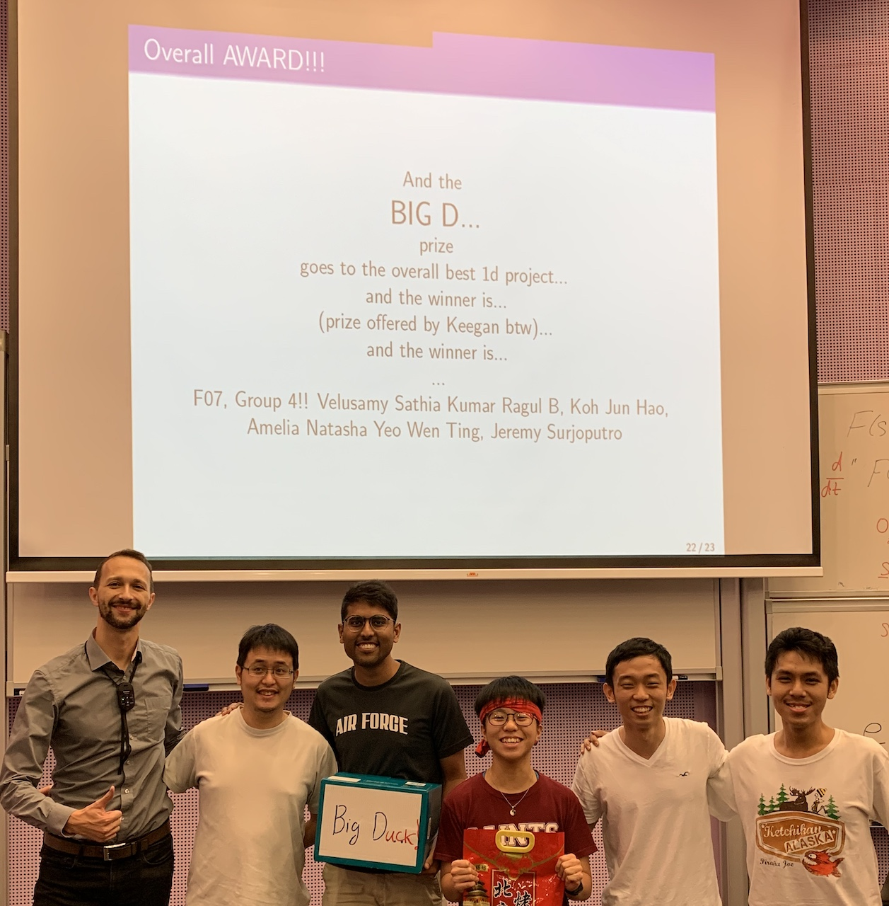

# Aircraft_Noise_Model_10.004_1D
SUTD 10.004 Advanced Mathematics II 2019 1D Project - Aircraft Noise Modelling

| Live model simulation hosted at [Aircraft Noise Model](https://ragulbalaji.github.io/Aircraft_Noise_Model_10.004_1D/) |
| :----------------------------------------------------------: |
| Report can be found at `reports/Term 2 Math 1D Modelling.pdf` |
| Best model among 10.004 Fall Term 2019 1D Projects  |
